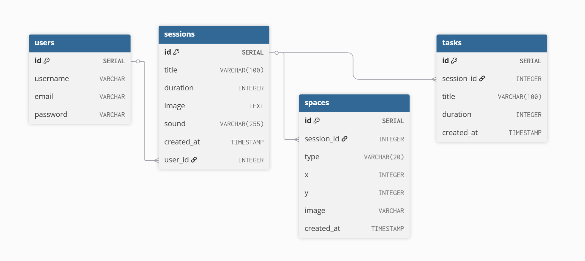

<p align="center">
  
</p>

# Space Backend

This repository contains the **backend** codebase for the Space App — a productivity platform that allows users to create timed focus sessions, manage tasks, and visualize their progress in a cosmic-themed interface.

---

## Project Description

The backend provides secure APIs for:

- User authentication and session management  
- CRUD operations for sessions and tasks  
- Real-time countdown logic  
- Data persistence and validation  
- Integration with frontend via RESTful endpoints

---

## Tech Stack

| Layer         | Technology         |
|---------------|--------------------|
| Language      | Python             |
| Framework     | Django REST Framework |
| Database      | PostgreSQL         |
| Auth          | JWT                |
| Deployment    | Docker-ready       |

---

## Frontend Repository

[Frontend ](https://github.com/alanod455/frontend-space--app)

---

## ERD Diagram

<p align="center">
  
</p>


## Routing Table

### Session Routes

| Method | Endpoint                        | Description                |
|--------|----------------------------------|----------------------------|
| GET    | `/sessions/`                    | Retrieve all sessions      |
| GET    | `/sessions/<session_id>/`       | Retrieve a specific session|

---

### Space Routes

| Method | Endpoint                                  | Description                   |
|--------|--------------------------------------------|-------------------------------|
| GET    | `/sessions/<session_id>/spaces/`          | Retrieve spaces for a session |

---

### Task Routes

| Method | Endpoint                                              | Description                    |
|--------|--------------------------------------------------------|--------------------------------|
| GET    | `/sessions/<session_id>/tasks/`                       | Retrieve tasks for a session   |
| GET    | `/sessions/<session_id>/tasks/<task_id>/`             | Retrieve a specific task       |

---

### User Routes

| Method | Endpoint                      | Description                    |
|--------|-------------------------------|--------------------------------|
| POST   | `/users/signup/`              | Create a new user              |
| POST   | `/users/login/`               | Log in and receive token       |
| POST   | `/users/token/refresh/`       | Refresh authentication token   |

## Installation Instructions (Docker)

To run the backend locally using Docker:


# Clone the repository
```
git clone https://github.com/alanod455/backend-space--app.git
cd backend-space--app
```

# Build and run the container
```
docker build -t space-backend .
docker run -p 8000:8000 backend
```

## IceBox Features

These features are planned but not yet implemented:

- Pause/Resume session timer  
- Analytics dashboard for session history  
- Light mode toggle  
- Notification reminders before session ends  
- AI-generated task suggestions  
- Interactive space animations with sound effects  
- PWA support for offline use  

---

Built with 💜 by a [Alanoud Almarshad](https://github.com/alanod455)
